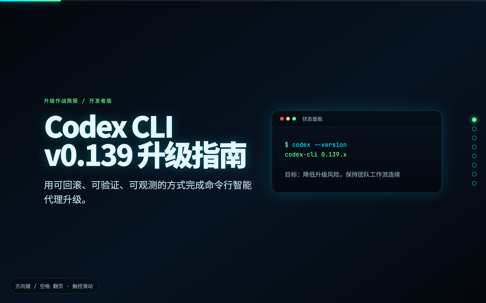
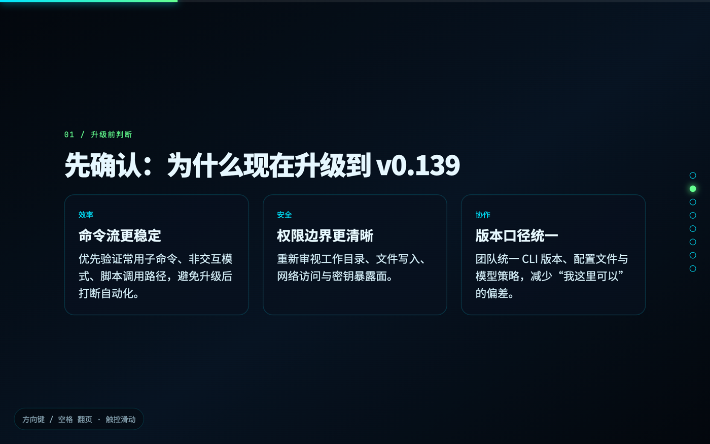
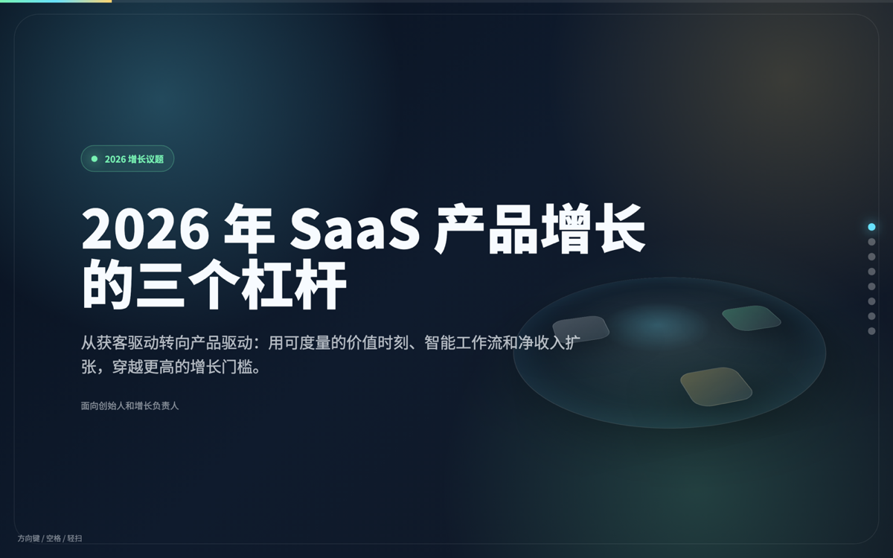
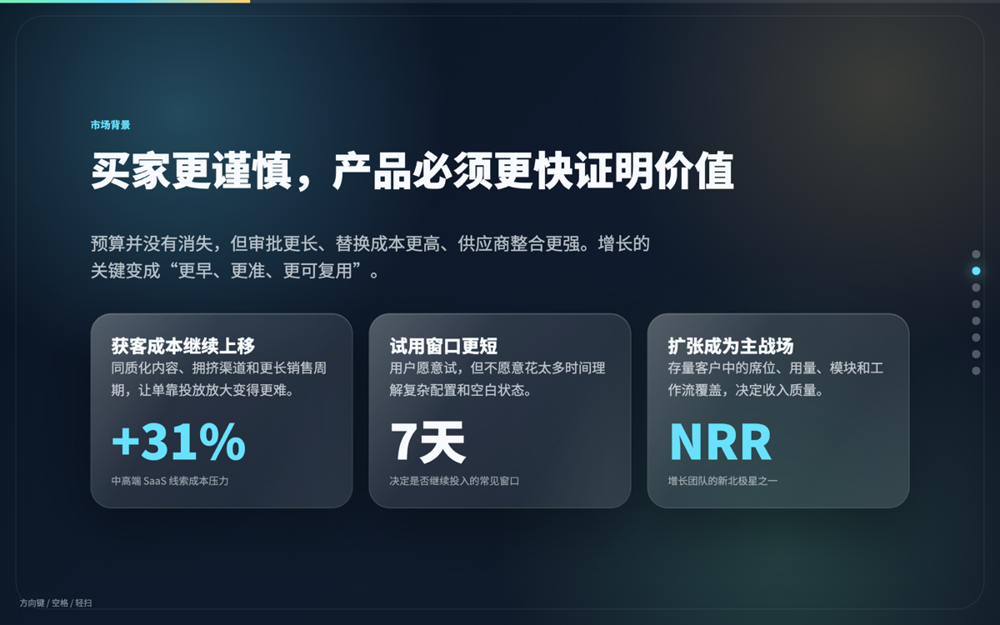
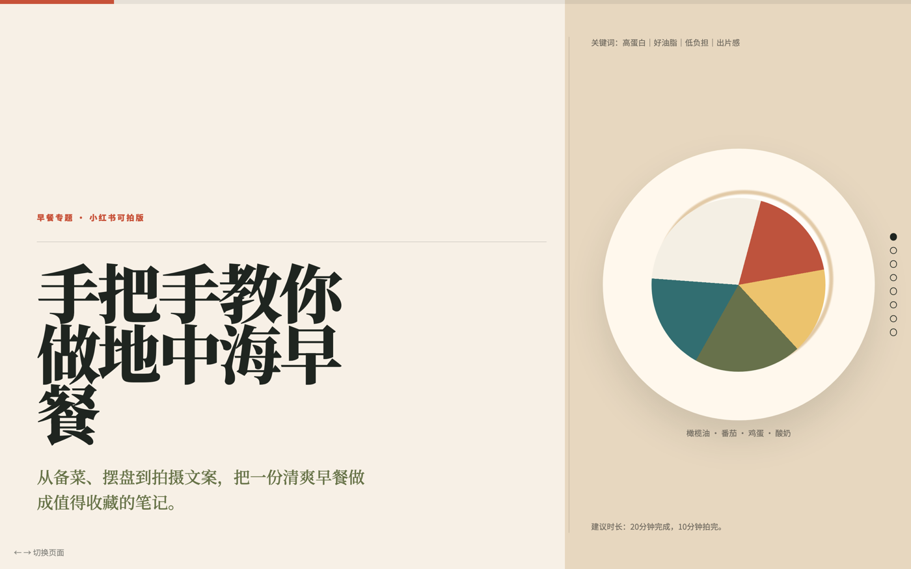
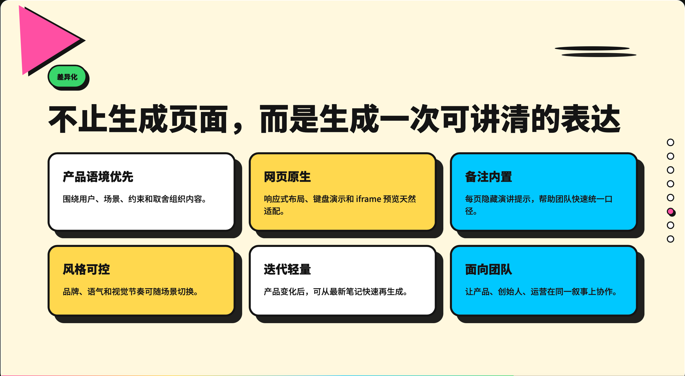

<div align="center">

# AIHTML

**输入一句话，AI 直接生成完整网页幻灯片。**

本地优先的 AI 网页幻灯片生成器，基于 [Presenton](https://github.com/presenton/presenton) 精简改造。

[快速开始](#快速开始) · [功能演示](#功能演示) · [风格一览](#风格一览) · [架构](#架构) · [常见问题](#常见问题)

</div>

---

## 使用演示

<video src="https://raw.githubusercontent.com/Usernames686/AIHTML/main/docs/assets/demo.mp4" controls muted autoplay loop playsinline width="100%" style="max-width:900px; border-radius:12px"></video>


---

## 为什么做 AIHTML

做一份 PowerPoint 的隐性成本远高于"写字"本身：找模板、调字号、对齐元素、配色、插入图表……这些工作往往占掉一整天，却跟"要表达什么"毫无关系。

AIHTML 把这件事压缩成三步：

1. **输入主题**（比如"Q3 季度总结"）
2. **选择风格**（14 种中文风格预设，覆盖发布会、汇报、教学等）
3. **点击生成** —— AI 吐出完整 HTML，浏览器直接打开就能讲

输出不是 `.pptx`，是一个**真正可部署的网页**。你可以：

- 浏览器中直接演示
- 嵌入自己的网站
- 上传到 GitHub Pages / Vercel / Netlify
- 用任何代码编辑器二次修改
- 几 KB 体积，邮件附件都能发

---

## 功能演示

### 真实生成效果（截图来自本地运行实例）

**风格一：赛博终端 · Codex CLI v0.139 升级指南**





**风格二：Bento 卡片 · 2026 年 SaaS 产品增长**





**风格三：编辑杂志 · 地中海早餐指南**



---

### AIHTML 跟其他"AI 写 PPT"工具的区别



**产品语境优先** —— 内容围绕用户、场景、约束与组织，不是"通用 PPT"。

**网页原生** —— 响应式布局、键盘演示、iframe 预览都是天然适配的。

**备注内置** —— 每页隐藏演讲提示，帮助团队快速统一口径。

**风格可控** —— 品牌语气、视觉节奏可以随场景切换。

**迭代轻量** —— 产品变化后，从最新笔记快速重新生成。

**面向团队** —— 产品、创始人、运营能在同一叙事上协作。

---

## 风格一览

项目内置 **14 种中文风格预设**，每种都有独立的视觉语言：

| 风格 | 适合场景 | 视觉关键词 |
|------|----------|------------|
| 🍎 苹果发布会风 | 产品发布、科技演讲 | 大留白、电影感渐变 |
| 🏦 投资人路演风 | 融资路演、商业计划书 | 增长数据、商业模式 |
| 🖤 黑曜石专业风 | AI/工程/技术深度分享 | 深色、克制、精准 |
| 📊 数据仪表风 | 数据汇报、指标看板 | KPI 层级、图表 |
| 🔷 蓝图设计 | 系统架构、技术方案 | 网格、线稿 |
| 📱 高端软件卡片风 | SaaS 产品演示 | 玻璃质感、卡片 |
| 📰 编辑杂志风 | 报告长文、行业分析 | 排版、引文 |
| 🎮 赛博终端 | 安全基建、开发工具 | 命令中心、终端 |
| 🎨 孟菲斯派对 | 社区故事、创意表达 | 几何、撞色 |
| 📖 手绘白板风 | 教学拆解、轻松科普 | 手绘、轻松 |
| 🎓 课程工作坊 | 培训课程 | 节奏、练习 |
| 🔮 80 年代未来 | 游戏发布、音乐文化 | 霓虹、复古 |
| ✨ 新极简温暖 | 高管汇报、策略叙事 | 留白、温暖 |
| 🔢 数字粗野立体风 | 创意发布 | 几何、立体 |

每种风格都对应不同的字体系统、配色逻辑、版式节奏 —— 不是简单的换色。

---

## 快速开始

### 方式一：Docker 一键部署（推荐）

需要本机已经装好 [Docker Desktop](https://www.docker.com/products/docker-desktop/)。

```bash
git clone https://github.com/Usernames686/AIHTML.git
cd AIHTML
docker compose up -d --build production
```

启动后打开浏览器：

```text
http://localhost:5000/slidecraft
```

部署在服务器上，把 `localhost` 换成服务器 IP 即可（默认端口 `5000`，可在 `docker-compose.yml` 修改）。

### 方式二：本地开发模式

适合需要改前后端代码的同学。

**1. 启动后端**（需要 Python 3.11，推荐用 [uv](https://docs.astral.sh/uv/)）

```bash
cd servers/fastapi
uv sync

# macOS / Linux
export APP_DATA_DIRECTORY="$PWD/app_data"
export TEMP_DIRECTORY="$PWD/user_data"
export USER_CONFIG_PATH="$PWD/user_data/user_config.json"
export DISABLE_AUTH=true

.venv/bin/python server.py --port 8000 --reload false
```

**2. 启动前端**（需要 Node.js 18+）

```bash
cd servers/nextjs
npm install
NEXT_PUBLIC_FAST_API=http://localhost:8000 npm run dev
```

打开 [http://localhost:3000/slidecraft](http://localhost:3000/slidecraft) 即可。

---

## 模型 API 配置

AIHTML 不绑定任何模型服务，支持所有 **OpenAI 兼容接口**。你可以使用 OpenAI 官方、Anthropic（通过代理）、国内大模型的中转 API，也可以接入本地 Ollama。

### 方式一：网页内配置（最方便）

进入 `/slidecraft` 页面，点击右上角 **「后端模型 API」** 配置入口，填写：

- **API 地址**：例如 `https://your-proxy.com/v1`
- **API Key**：你的访问密钥
- **模型名称**：例如 `gpt-5.5`、`claude-sonnet-4-20250514`、`qwen-plus`

配置会保存到 `user_data/user_config.json`，后续生成自动读取。

### 方式二：环境变量（适合部署）

启动 Docker 前在 `.env` 文件写入：

```env
LLM=custom
CUSTOM_LLM_URL=https://your-proxy.com/v1
CUSTOM_LLM_API_KEY=your-api-key
CUSTOM_MODEL=gpt-5.5
CAN_CHANGE_KEYS=true
DISABLE_AUTH=true
DISABLE_IMAGE_GENERATION=true
```

也可以直接用 OpenAI 官方：

```env
LLM=openai
OPENAI_API_KEY=sk-...
OPENAI_MODEL=gpt-4o-mini
CAN_CHANGE_KEYS=true
DISABLE_AUTH=true
DISABLE_IMAGE_GENERATION=true
```

### 方式三：本地 Ollama（完全离线）

```env
LLM=ollama
OLLAMA_URL=http://host.docker.internal:11434
OLLAMA_MODEL=qwen2.5:7b
```

---

## 使用流程

```
1. 打开 /slidecraft 页面
       ↓
2. 在左侧填写「内容简述」（想讲什么）
       ↓
3. 选择「目标受众」、「语言」、「页数」
       ↓
4. 从 14 种风格中选一种
       ↓
5. （可选）在「补充要求」里写细节、要求
       ↓
6. 点击「生成」
       ↓
7. 右侧实时预览生成的 HTML 幻灯片
       ↓
8. 复制 HTML / 下载 .html / 全屏演示
```

### 高级用法：嵌入本地图片和视频

由于 AIHTML 输出的是自包含 HTML，可以**在「补充要求」里直接要求 AI 嵌入素材**。

**嵌入 base64 图片**（小图推荐）：

```
在第三页用以下 base64 图片替换背景：
data:image/png;base64,iVBORw0KGgo...
```

**嵌入视频（用本地 HTTP 服务）**：

```bash
# 在素材目录起一个文件服务器
cd ~/Desktop/materials
python3 -m http.server 9000
```

然后在补充要求里写：

```
在第二页嵌入产品演示视频：
<video src="http://localhost:9000/demo.mp4" controls autoplay muted loop style="width:100%; border-radius:20px">
```

视频无法用 base64 嵌入（太大），必须用 HTTP 服务或者上传到 OSS / Cloudflare R2。

---

## 架构

### 技术栈

| 层级 | 技术 |
|------|------|
| 前端 | Next.js 14 · React 18 · TypeScript · Tailwind CSS · Radix UI |
| 后端 | FastAPI · Python 3.11 · SQLModel · Pydantic |
| LLM 客户端 | [llmai](https://github.com/presenton/llmai) 0.2.x（OpenAI / Anthropic / Google / Azure 全兼容） |
| 部署 | Docker · Nginx |
| 包管理 | uv（后端）· npm（前端） |

### 项目结构

```text
AIHTML
├── docker-compose.yml                # 生产部署编排
├── Dockerfile                        # 生产镜像构建
├── Dockerfile.dev                    # 开发镜像构建
├── nginx.conf                        # 反向代理配置
├── start.js                          # 单进程入口（生产）
├── app_data/                         # 生产环境持久化数据
├── user_data/                        # 本地开发持久化数据
├── docs/
│   └── assets/                       # README 用的图和视频
├── servers/
│   ├── fastapi/                      # 后端 API 服务
│   │   ├── api/v1/ppt/endpoints/
│   │   │   └── slidecraft.py         # 核心 HTML 幻灯片生成接口
│   │   ├── services/                 # LLM 客户端、Schema 校验
│   │   ├── utils/                    # 环境变量读取、错误处理
│   │   ├── models/                   # Pydantic 数据模型
│   │   └── server.py                 # uvicorn 启动入口
│   └── nextjs/                       # 前端 Next.js 应用
│       └── app/(presentation-generator)/(dashboard)/slidecraft/
│           └── SlideCraftWorkbench.tsx   # 主工作台
└── README.md
```

### 核心代码导读

**后端 `slidecraft.py`**：定义了 14 种风格的视觉描述、JSON Schema 校验规则、System Prompt 约束。LLM 必须返回严格 JSON，包含 `title` / `html` / `warnings`。返回的 HTML 必须包含 `<!doctype html>`、`<section class="slide">`、`<script>` 控制器（实现键盘翻页、自动缩放、触摸滑动）。

**前端 `SlideCraftWorkbench.tsx`**：主工作台 UI。包含输入区（内容简述、受众、页数、风格、补充要求）、实时预览、模型 API 配置弹窗、下载按钮。

---

## 常见问题

<details>
<summary><b>Q: 生成的 HTML 包含哪些功能？</b></summary>

- 键盘翻页（← → Space Home End）
- 触摸滑动翻页
- 进度条
- 右侧导航圆点
- 演讲备注（按 N 切换显示）
- 响应式缩放（自动 fit 视口）
- 减弱动效模式（`prefers-reduced-motion`）

</details>

<details>
<summary><b>Q: 生成的 HTML 可以商用吗？</b></summary>

生成的 HTML 内容归你所有，可以任意使用。模板代码本身继承 Presenton 的 Apache 2.0 协议。

</details>

<details>
<summary><b>Q: 支持哪些 LLM？</b></summary>

支持所有 OpenAI 兼容接口的 LLM：
- OpenAI（gpt-4o、gpt-4o-mini、gpt-5.x）
- Anthropic Claude（通过代理）
- Google Gemini（通过代理）
- 国内大模型（DeepSeek、Qwen、GLM、Kimi 等）
- 本地 Ollama（qwen2.5、llama3 等）

</details>

<details>
<summary><b>Q: Docker 启动后访问不了？</b></summary>

1. 确认端口未被占用：`lsof -i :5000`
2. 查看日志：`docker compose logs -f production`
3. 确认 Docker Desktop 正在运行

</details>

<details>
<summary><b>Q: 生成内容质量不理想？</b></summary>

在「补充要求」里写明：
- 必须包含哪些要点
- 表达语气（专业 / 轻松 / 严谨）
- 排除哪些内容
- 目标字数

例：`用第二人称写，每页不超过 50 字，避免使用专业术语`。

</details>

---

## 常用命令

```bash
# 重新构建并启动
docker compose up -d --build production

# 查看状态
docker compose ps

# 查看实时日志
docker compose logs -f production

# 停止服务
docker compose down

# 完全清理（包括数据卷）
docker compose down -v
```

---

## 路线图

- [ ] 视觉风格实时编辑（生成后用 AI 微调某页）
- [ ] 多语言切换（中英日韩）
- [ ] 协作模式（多人编辑同一份幻灯片）
- [ ] 模板市场（社区贡献风格）
- [ ] 导出 PDF（通过浏览器打印）
- [ ] 接入 Diagram / Chart 渲染

欢迎在 [Issues](https://github.com/Usernames686/AIHTML/issues) 里提需求和想法。

---

## 贡献

PR 随时欢迎！建议流程：

1. Fork 仓库
2. 创建特性分支（`git checkout -b feature/awesome-thing`）
3. 提交改动（`git commit -m 'feat: add awesome thing'`）
4. 推送到分支（`git push origin feature/awesome-thing`）
5. 提交 Pull Request

### 本地开发

```bash
# 后端（端口 8000）
cd servers/fastapi
uv sync
uv run python server.py --port 8000 --reload true

# 前端（端口 3000）
cd servers/nextjs
npm install
NEXT_PUBLIC_FAST_API=http://localhost:8000 npm run dev
```

### 代码风格

- Python：black + isort
- TypeScript：prettier + eslint
- 提交信息：遵循 [Conventional Commits](https://www.conventionalcommits.org/)

---

## 致谢

- [Presenton](https://github.com/presenton/presenton) —— 提供了核心架构灵感，本项目在其基础上精简改造
- [llmai](https://github.com/presenton/llmai) —— LLM 统一客户端
- 所有贡献者和使用者

---

## 许可

本项目继承 Presenton 的 Apache 2.0 协议。详见 [LICENSE](./LICENSE)。

---

<div align="center">

如果觉得有用，欢迎 Star 一下 ⭐

[GitHub](https://github.com/Usernames686/AIHTML) · [Issues](https://github.com/Usernames686/AIHTML/issues)

</div>
